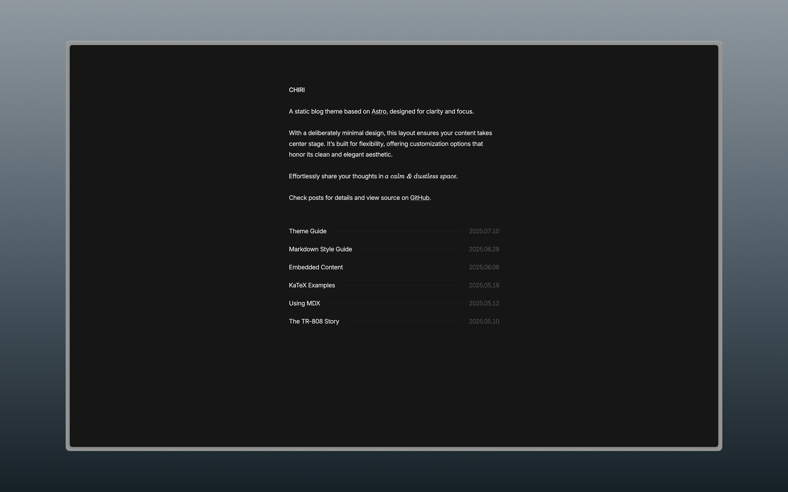

```sh
  # to deploy
  npx astro build && npx wrangler deploy
```


# Astro Starter Kit: Basics

```sh
yarn create astro@latest -- --template basics
```

> 🧑‍🚀 **Seasoned astronaut?** Delete this file. Have fun!

## 🚀 Project Structure

Inside of your Astro project, you'll see the following folders and files:

```text
/
├── public/
│   └── favicon.svg
├── src
│   ├── assets
│   │   └── astro.svg
│   ├── components
│   │   └── Welcome.astro
│   ├── layouts
│   │   └── Layout.astro
│   └── pages
│       └── index.astro
└── package.json
```

To learn more about the folder structure of an Astro project, refer to [our guide on project structure](https://docs.astro.build/en/basics/project-structure/).

## 🧞 Commands

All commands are run from the root of the project, from a terminal:

| Command                   | Action                                           |
| :------------------------ | :----------------------------------------------- |
| `yarn install`             | Installs dependencies                            |
| `yarn dev`             | Starts local dev server at `localhost:4321`      |
| `yarn build`           | Build your production site to `./dist/`          |
| `yarn preview`         | Preview your build locally, before deploying     |
| `yarn astro ...`       | Run CLI commands like `astro add`, `astro check` |
| `yarn astro -- --help` | Get help using the Astro CLI                     |

## 👀 Want to learn more?

Feel free to check [our documentation](https://docs.astro.build) or jump into our [Discord server](https://astro.build/chat).

====================
# Chiri 🌸




Chiri is a minimal blog theme built with [Astro](https://astro.build), offering customization options while preserving its clean aesthetic.

Check the [demo](https://astro-chiri.netlify.app/) for more details.

## Features

- Built with Astro
- Responsive
- Light / Dark mode
- MDX
- KaTeX
- Sitemap
- OpenGraph
- RSS
- ...

## Getting Started

1. [Fork](https://github.com/the3ash/astro-chiri/fork) this repository, or use this template to [create a new repository](https://github.com/new?template_name=astro-chiri&template_owner=the3ash).

2. Run the following commands:

   ```bash
   git clone <your-repo-url>

   cd <your-repo-name>

   pnpm install

   pnpm dev
   ```

3. Edit `src/config.ts` and `src/content/about/about.md` to your liking.

4. Use `pnpm new <title>` to create new posts, or add your posts to `src/content/posts`.

5. You need to set adapter as follows before deploying to Netlify, Vercel, or other platforms, but you can set `linkCard` to `false` in `src/config.ts` to skip this step:
   - **Netlify**: `pnpm add @astrojs/netlify` and add `adapter: netlify()` in `astro.config.ts`.
   - **Vercel**: `pnpm add @astrojs/vercel` and add `adapter: vercel()` in `astro.config.ts`.
   - **Cloudflare Pages**: `pnpm add @astrojs/cloudflare` and add `adapter: cloudflare()` in `astro.config.ts`.
   - **Static (e.g. GitHub Pages)**: `pnpm add @astrojs/static` and add `adapter: static()` in `astro.config.ts`.
   - Refer to [Astro Deployment Guides](https://docs.astro.build/en/guides/deploy/) for more details.

&emsp;[](https://app.netlify.com/start) [](https://vercel.com/new) [](https://pages.cloudflare.com/start)

## Commands

- `pnpm new <title>` - Create a new post (use `_title` for drafts)
- `pnpm update-theme` - Update the theme to the latest version

## References

- https://paco.me/
- https://benji.org/
- https://shud.in/
- https://retypeset.radishzz.cc/

## License
MIT
